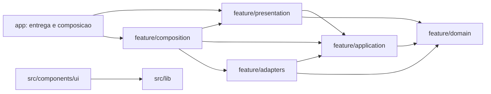

# Arquitetura

## Decisao

O software adota um **monolito modular feature-first com Ports & Adapters
incremental**.

Essa arquitetura concentra cada conceito em uma fatia vertical, preserva uma
unica aplicacao implantavel e introduz seams de infraestrutura apenas quando
existem regras, efeitos externos ou implementacoes substituiveis.

Objetivos:

- manter alta locality por feature;
- permitir crescimento sem espalhar conceitos por pastas tecnicas globais;
- desacoplar regras futuras de Next.js, React e fornecedores;
- preservar Server Components e as convencoes do App Router;
- evitar microfrontends e abstracoes especulativas.

## Organizacao

O projeto usa uma organizacao feature-first:

```text
src/
  app/                   # rotas, layouts, metadata e composition roots
  components/ui/         # primitives visuais reutilizaveis
  components/            # modules compartilhados sem linguagem de dominio
  features/
  <feature>/
    domain/              # regras e tipos puros, quando existirem
    application/         # casos de uso e ports, quando necessarios
    adapters/            # integracoes e mapeamento de tecnologia
    presentation/        # modulos React especificos da feature
  lib/                   # utilitarios genericos sem linguagem de dominio
public/                  # assets publicos
```

Pastas internas de uma feature devem ser criadas apenas quando tiverem uma
responsabilidade concreta. Nao criar a arvore completa como placeholder.

Cada module expoe uma interface publica pequena por `index.ts`. Imports entre
features atravessam somente essa interface.

## Direcao de Dependencias

Dependencias apontam para dentro:



Regras:

- `domain` nao importa React, Next.js, SDKs, acesso a dados ou variaveis de
  ambiente.
- `application` orquestra comportamento e depende apenas de `domain` e dos
  ports que possui.
- `adapters` traduz detalhes de framework, transporte, persistencia e SDK.
- `presentation` pode usar React e primitives de `src/components/ui`, mas nao
  concentra regras do dominio.
- `app` e o composition root: conecta presentation, casos de uso e adapters.
- Uma feature complexa pode ter `composition/`; `app` chama essa composicao sem
  conhecer detalhes internos.
- Uma feature nao importa implementacoes internas de outra feature. Quando a
  colaboracao for real, expor uma interface pequena no modulo proprietario.
- `lib` nao recebe conceitos como Projeto, Experiencia ou Contato. Codigo com
  linguagem do dominio pertence a uma feature.

## Modularizacao

- Um arquivo de component declara exatamente um React component.
- Components auxiliares vivem em arquivos proprios.
- Tipos, constantes, hooks, schemas e utilitarios ficam separados.
- `index.ts` reexporta somente a interface publica do module.
- Components interativos devem ser folhas pequenas da arvore.
- Arquivos devem ser organizados por responsabilidade e conceito, nao por
  tamanho arbitrario.

Exemplo:

```text
src/components/
  site-header/
    site-header.tsx
    site-logo.tsx
    desktop-navigation-link.tsx
    navigation.constants.ts
    index.ts
```

## Quando Usar Ports & Adapters

Criar um port somente quando houver um efeito externo ou duas implementacoes
reais/provaveis, por exemplo:

- envio de Contato por provedor externo;
- leitura de Projetos em CMS;
- analytics com adapter de producao e adapter in-memory para testes;
- relogio ou gerador de identificadores usados por uma regra.

Nao criar ports para dados estaticos, funcoes puras ou um unico acesso local sem
perspectiva concreta de variacao. Um adapter unico representa apenas uma seam
hipotetica.

## Estrategia de Testes

- `domain`: testes puros de regras e invariantes.
- `application`: testes de casos de uso com adapters in-memory.
- `adapters`: testes de integracao e de contrato.
- `presentation`: testes de comportamento acessivel ao usuario.
- `app`: poucos testes end-to-end para jornadas criticas.

Enquanto o projeto for somente apresentacional, lint, type checking e build sao
o baseline. Testes surgem junto com comportamento que possa regredir.

## Criterios de Profundidade

Antes de extrair um modulo:

1. Aplicar o deletion test: remover o modulo elimina complexidade ou espalha a
   mesma complexidade pelos callers?
2. Manter a interface menor que a implementacao que ela esconde.
3. Favorecer locality: mudanca e verificacao devem se concentrar em um lugar.
4. Exigir leverage: a interface deve atender mais de um caller, teste ou
   implementacao relevante.

## Evolucao

Migrar por fatias verticais. A primeira feature com comportamento e efeito
externo deve estabelecer o padrao executavel; as demais repetem o modelo apenas
quando o mesmo tipo de seam existir.

Decisoes duradouras ficam em `.agents/specs/decisions/`. O vocabulario
compartilhado fica em `CONTEXT.md`.

Os padroes obrigatorios de TypeScript, Next.js, shadcn, design e Tailwind CSS
ficam em `.agents/specs/engineering/frontend-standards.md`.

As decisoes formais vigentes estao em ADR-0001, ADR-0002 e ADR-0003.

## Internacionalizacao

Internacionalizacao e um module transversal com interface gerada pelo
Paraglide. Ele pertence ao edge da aplicacao e nao entra em `domain`.

- Message functions podem ser consumidas por `presentation`, rotas e metadata.
- Locale routing e responsabilidade do adapter Next.js/Paraglide.
- Nuqs gerencia somente query state e nao participa da selecao de locale.
- Regras detalhadas ficam em
  `.agents/specs/internationalization/paraglide-and-url-state.md`.
